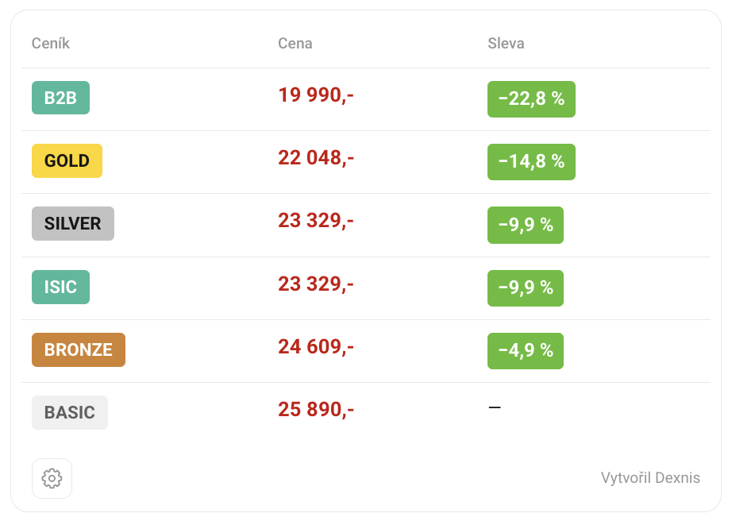

# Alza Benefit Prices

Userscript pro Alza.cz a Alza.sk, který přímo na stránce produktu zobrazí ceny ceníků Gold, Silver, ISIC, Bronze, B2B a Basic včetně procentuálních slev.

## Ukázka userscriptu

## Instalace

[Nainstalovat Alza Benefit Prices](https://raw.githubusercontent.com/dexnis-dev/Alza-Benefit-Prices/main/alza-benefit-prices.user.js)

### Chromium a Firefox

1. Nainstaluj správce userscriptů **Violentmonkey**:
   - [Chrome, Opera a další prohlížeče Chromium](https://chromewebstore.google.com/detail/violentmonkey/jinjaccalgkegednnccohejagnlnfdag)
   - [Microsoft Edge](https://microsoftedge.microsoft.com/addons/detail/violentmonkey/eeagobfjdenkkddmbclomhiblgggliao)
   - [Firefox](https://addons.mozilla.org/firefox/addon/violentmonkey/)
2. Otevři instalační odkaz výše a potvrď instalaci ve Violentmonkey.
3. Otevři nebo obnov stránku produktu na Alze.

### Safari

1. Nainstaluj [Userscripts z App Store](https://apps.apple.com/cz/app/userscripts/id1463298887?l=cs).
2. Zapni Userscripts v nastavení rozšíření Safari a povol přístup k Alze a webapi.alza.cz.
3. Otevři instalační odkaz v Safari, klikni na ikonu Userscripts a potvrď instalaci.
4. Obnov stránku produktu na Alze.

Pokud se instalace nenabídne, zkopíruj celý obsah skriptu do editoru Userscripts jako nový JavaScript a ulož ho.

## Nastavení

- **Ceníky:** zapnutí a vypnutí jednotlivých ceníků.
- **Akce:** zapnutí a vypnutí AlzaPlus+ a Cashback/Výkup.

Nastavení se ukládá automaticky. Skript vybere nejnižší cenu z povolených akcí. Pokud mají všechny načtené ceníky stejnou cenu, zobrazí místo tabulky krátkou zprávu.

Podporuje také mobilní verze m.alza.cz a m.alza.sk

Vytvořil Dexnis
